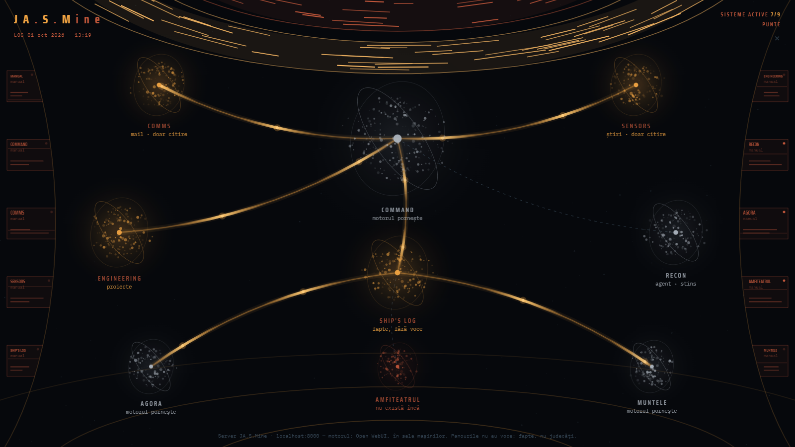
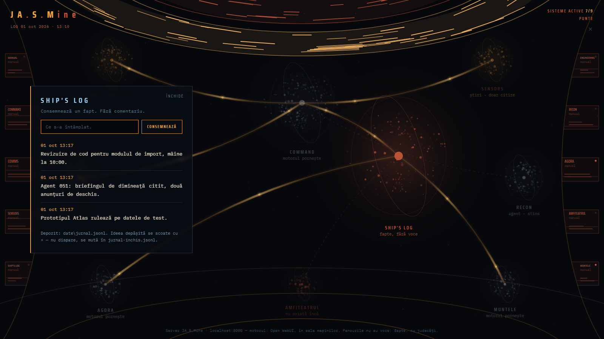

# JA.S.Mine

JA.S.Mine is a personal AI assistant that runs on a Windows laptop as a full-screen "bridge": one
page with a map of rooms, each room a single job (mail report, news, a log of facts, a job-search
agent, three conversation rooms). It answers to three layers built on Claude: **Sky** gives facts
and calls tools, **Socrate** questions your reasoning instead of answering it, and **Ramana** talks
in the spirit of Ramana Maharshi's teaching. Facts come from code and tools, never from the model;
the model only phrases them.

The name stands for **JA**rvis · **S**ocrate · Ramana **M**aharshi. It is written `JA.S.Mine`
where it is read and `Jasmine` where it is typed.

JA.S.Mine is the front end of [Agent 051](https://github.com/Mihai-Streanga/Agent051-public), a
separate program that reads job alert emails and ranks the listings. The RECON room and Sky's
job tools talk to it over MCP; JA.S.Mine asks, the agent keeps its own data.

> Code comments are in Romanian. So are identifiers, UI texts, prompts and configuration keys.

## Screenshots

The bridge, with fictional data and both back ends switched off (see
[Example output](#example-output)):





## How it works

- **The bridge** (`punte.html`) is a single page served by the local server and opened in Chrome
  kiosk mode. Each node on the map is a room; the panels on the walls are the manuals.
- **The server** (`server/server.py`, FastAPI, port 8000) owns everything on disk: the log,
  conversations, the mail report, the news report, the persona prompts. It listens on
  `127.0.0.1` only and refuses requests whose `Host` or `Origin` is not `localhost:8000`.
- **Conversation** goes through [Open WebUI](https://openwebui.com/), running in Docker, which
  holds the connection to Claude. JA.S.Mine is a client of it: the server sends the whole thread
  each turn, executes the tool calls itself, and stores the thread under `date/conversatii/`.
- **The three layers** are three models in Open WebUI. Their system prompts live in
  `persona/*.md` and the server pushes them to Open WebUI at start-up, so the file is the source
  of truth, not the Open WebUI settings.
- **Dictation** is local: Whisper on the integrated GPU through OpenVINO, with faster-whisper on
  the CPU as a fallback. Two spoken words open and close the command room: "engage" / "start"
  and "disengage" / "stop". No audio leaves the machine.
- **Rooms**: COMMAND (Sky), AGORA (Socrate), MUNTELE (Ramana, with a looping video clip),
  COMMS (unread Gmail since the last report, read-only IMAP), SENSORS (news from RSS feeds and
  news sitemaps), SHIP'S LOG (facts, no comments), ENGINEERING (project status from a JSON
  file), RECON (Agent 051). AMFITEATRUL is a placeholder for a future project.

## Tech stack

- Python 3.14 (Windows 11)
- [FastAPI](https://fastapi.tiangolo.com/) with uvicorn, `httpx`, `python-dotenv`
- [Open WebUI](https://openwebui.com/) in Docker, as the conversation engine
- Claude (Anthropic), reached through Open WebUI
- [Model Context Protocol](https://modelcontextprotocol.io/) client (`mcp`) for Agent 051
- [OpenVINO GenAI](https://github.com/openvinotoolkit/openvino.genai) Whisper on the iGPU,
  [faster-whisper](https://github.com/SYSTRAN/faster-whisper) as fallback, `av` for decoding
- Plain HTML, CSS and JavaScript for the bridge (no framework, no build step), with IBM Plex
  Mono and Saira Condensed fonts (SIL Open Font License)
- VBScript launcher for Windows

## Installation

You need Windows 10/11, Python 3.14, [Docker Desktop](https://www.docker.com/products/docker-desktop/)
and Google Chrome. Optional: a Gmail account with an
[app password](https://support.google.com/accounts/answer/185833) for COMMS, and
[Agent 051](https://github.com/Mihai-Streanga/Agent051-public) for RECON.

```bat
git clone https://github.com/<your-user>/Jasmine-public.git Jasmine
cd Jasmine
python -m venv .venv
.venv\Scripts\python.exe -m pip install -r requirements.txt
copy server\.env.example server\.env
```

**Open WebUI.** Start the container once; it restarts with Docker afterwards:

```bat
docker run -d --name jasmine -p 3000:8080 -v jasmine-openwebui:/app/backend/data --restart always ghcr.io/open-webui/open-webui:main
```

Then, at `http://localhost:3000`:

1. Create the admin account and add a connection to a Claude model (for example through
   Anthropic's OpenAI-compatible API in *Admin settings → Connections*).
2. In *Workspace → Models*, create three models on top of it, with the IDs used in
   `persona/straturi.json`: `sky`, `-socrate` and `ramana`. Leave the system prompt empty; the
   server fills it in from `persona/*.md`.
3. In *Settings → Account*, create an API key and put it in `server/.env` as `OPENWEBUI_KEY`.

**Dictation models** (about 0.8 GB, stored in the Hugging Face cache, outside the repository):

```bat
.venv\Scripts\python.exe -c "from huggingface_hub import snapshot_download; snapshot_download('OpenVINO/whisper-large-v3-turbo-int8-ov')"
```

The faster-whisper fallback model (`large-v3-turbo`, about 1.5 GB) is optional but recommended;
the server never downloads models by itself, so fetch it once too:

```bat
.venv\Scripts\python.exe -c "from faster_whisper import download_model; download_model('large-v3-turbo')"
```

**MUNTELE clips** (optional). Put `yt-dlp.exe` and `ffmpeg.exe` in `media\unelte\`, then:

```bat
.venv\Scripts\python.exe server\descarca-munte.py
```

The clip list, order and volume are in `server/munte.json`. Without the clips the room still
works; it says what is missing.

Check that everything is in place:

```bat
.venv\Scripts\python.exe tests\test_conversatii.py
.venv\Scripts\python.exe tests\test_mail.py
.venv\Scripts\python.exe tests\test_securitate.py
.venv\Scripts\python.exe tests\test_stiri.py
```

These need no keys, no network and no running server.

`tests\test_recon.py` is an integration test for the contract with Agent 051:

```bat
.venv\Scripts\python.exe tests\test_recon.py
```

Without a real `MCP_TOKEN` (the value from `.env.example` counts as missing), or when Agent 051
does not answer or rejects the token, it is **skipped**, not failed: it prints
`SĂRIT — necesită Agent051 pornit și MCP_TOKEN real` with the reason and exits with 0. It fails
only when the agent answers and the shape of its replies does not match what JA.S.Mine reads.
To run it for real, start Agent 051 and put the same `MCP_TOKEN` in both `.env` files.

## Usage

Start the server and open the bridge in a normal browser window:

```bat
cd server
..\.venv\Scripts\python.exe server.py
```

then go to `http://localhost:8000`. `Ctrl+C` stops it.

`server\reporneste-jasmine.vbs` is the everyday entry point: it starts Docker Desktop if needed,
starts the server only if it is not already answering, and opens the bridge in Chrome kiosk mode
(or brings the open one to the front). It runs `py`, so it uses the Python launcher's default
interpreter; with a virtual environment, start the server by hand as above. Closing the bridge
with **×** stops Docker Desktop and the server.

Keys: **Alt+A** does what the spoken words do. **Escape** cancels a pending send, then closes the
open panel, then minimizes the bridge.

### Example output

The run below is real output from this repository, started with the values from
`server/.env.example` and with both back ends deliberately unreachable (Open WebUI and Agent 051
pointed at a closed port). **No model was called and none was simulated**: the screenshots and
the output show what works without keys. Port 8000 was busy on the test machine, so the server
was started with uvicorn on port 8010 and the requests carried `Host: localhost:8000`.

Server console at start-up. The persona sync fails because Open WebUI is unreachable and keeps
retrying; dictation loads on the iGPU:

```text
INFO:     Started server process [12416]
INFO:     Waiting for application startup.
INFO:     Application startup complete.
INFO:     Uvicorn running on http://127.0.0.1:8010 (Press CTRL+C to quit)
  persona: NESINCRONIZATA - sky: nu pot citi modelul: ConnectError: All connection attempts failed; socrate: nu pot citi modelul: ConnectError: All connection attempts failed; ramana: nu pot citi modelul: ConnectError: All connection attempts failed; paznicul incearca mai departe
  dictare: incepe incarcarea (plasa de la pornire)
  dictare: OpenVINO/whisper-large-v3-turbo-int8-ov pe GPU compilat in 1.94 s, incalzire 3.73 s
```

Writing to SHIP'S LOG (`POST /api/jurnal`). The server, not the browser, sets the time:

```text
{"cand":"2026-10-01T13:17:18","text":"Prototipul Atlas rulează pe datele de test."}
{"cand":"2026-10-01T13:17:19","text":"Agent 051: briefingul de dimineață citit, două anunțuri de deschis."}
{"cand":"2026-10-01T13:17:19","text":"Revizuire de cod pentru modulul de import, mâine la 10:00."}
```

`GET /api/stare`, shortened. Each back end names itself and says why it is down:

```json
{
    "server": "ok",
    "punte": true,
    "intrari_jurnal": 3,
    "servere": {
        "open_webui": {
            "viu": false,
            "unde": "http://127.0.0.1:9",
            "porneste": true,
            "cum": "porneste",
            "motiv": "nu raspunde (ConnectTimeout) — motorul porneste"
        },
        "agent_051": {
            "viu": false,
            "unde": "http://127.0.0.1:9/mcp",
            "motiv": "nu raspunde — ConnectError: All connection attempts failed"
        }
    }
}
```

`GET /api/proiecte` reads the ENGINEERING list from `date/proiecte.json` (fictional projects):

```json
{
    "ok": true,
    "proiecte": [
        {"n": "Atlas", "s": "1 modul prototip funcțional / 5 arhitectură definită", "u": "28 iul"},
        {"n": "Agent 051", "s": "pipeline live", "u": "28 iul"},
        {"n": "JA.S.Mine", "s": "trei straturi · dictare, cele două cuvinte, MUNTELE", "u": "24 aug"}
    ]
}
```

## Configuration

`server/.env` (copied from `server/.env.example`):

| Variable | What to put there |
|---|---|
| `OPENWEBUI_URL` | the Open WebUI address, `http://localhost:3000` with the command above |
| `OPENWEBUI_KEY` | an Open WebUI API key (*Settings → Account*) |
| `RECON_MCP_URL` | Agent 051's MCP endpoint, `http://127.0.0.1:8051/mcp` by default |
| `MCP_TOKEN` | the same token as in Agent 051's `.env` |
| `GMAIL_USER` | your Gmail address (COMMS) |
| `GMAIL_APP_PASSWORD` | a Gmail app password, not your account password |
| `GMAIL_FOLDER_COMMS` | the folder COMMS reports on, `INBOX` by default |
| `GMAIL_ETICHETA_EXCLUSA` | optional: a Gmail label to leave out of the report (e.g. the job alerts Agent 051 reads) |

Files read at every request or start-up, so most changes need no restart:

| File | What it controls |
|---|---|
| `persona/straturi.json` | the three layers: Open WebUI model ID, label, waiting text, prompt file. The server refuses to start without it |
| `persona/sky.md`, `socrate.md`, `ramana.md` | the system prompts; the block under the "Promptul" heading is what gets synced |
| `persona/dosar.md` | chapters inserted into a prompt with a `{{dosar:name}}` line (an example profile here); lines starting with `>` are never sent |
| `server/dictare.json` | dictation model, device, thresholds and the wake / sleep words |
| `server/stiri.json` | SENSORS news sources (RSS or news sitemaps) and limits |
| `server/munte.json` | MUNTELE clips, their folder and the volume |
| `date/proiecte.json` | the ENGINEERING project list |

Runtime data (log, conversations, reports) is written under `date/` and is not versioned.

## Known limitations

- **Windows only.** The launcher is VBScript, window handling uses PowerShell and Win32 calls,
  and the kiosk relies on Chrome's command line.
- **Needs Open WebUI and a paid Claude API connection** for the three conversation rooms. Without
  them the bridge, SHIP'S LOG, ENGINEERING and SENSORS still work; COMMAND, AGORA and MUNTELE stay
  dark with the reason shown.
- **Without keys:** COMMS needs a Gmail app password, RECON and Sky's job tools need Agent 051
  running with a matching `MCP_TOKEN`, and `tests/test_recon.py` is skipped until both are in place.
- **Dictation is tuned for Romanian** and for an Intel iGPU. Without an OpenVINO-visible GPU it
  falls back to faster-whisper on the CPU, which is slower.
- **The `-socrate` model ID** starts with a minus sign for historical reasons; it has to match
  the ID in Open WebUI.
- **No streaming:** answers arrive whole.
- **Closing with × stops Docker Desktop**, including any other containers you run.
- The UI, prompts and messages are in Romanian.

## License

[MIT](LICENSE) © 2026 Mihai Streanga
